<div align="center">
  <h1>🚦 Traffic Violation AI Pipeline</h1>
  <p>An intelligent, end-to-end computer vision web application to detect and analyze traffic violations.</p>

  <!-- Badges -->
  <p>
    
    
    
    
    
    
  </p>
</div>

---

## 📖 What it does

**Traffic Violation AI** is a comprehensive AI-powered application designed to automate the detection, classification, documentation, and reporting of traffic violations from surveillance footage. Designed for high accuracy, scalability, and robustness in real-world conditions, it identifies common infractions and creates actionable evidence records automatically.

### ⚠️ Problems Addressed
- **Massive Image Volume:** Thousands of images per camera daily make manual review impossible.
- **Delayed Enforcement:** Violations discovered hours or days later.
- **Human Errors:** Missed violations, fatigue-related mistakes, and inconsistent judgments.
- **Difficult Conditions:** Reduced accuracy due to rain, nighttime environments, and motion blur.
- **Missing Plates:** Vehicle identification challenges when number plates are unreadable.

### 🎯 Key Features & Real-world Impact
- **Road Safety Impact:** Reduces accident risks and improves compliance with traffic laws.
- **Administrative Efficiency:** Drastically lowers manpower costs and evidence management burden.
- **Automated Evidence Generation:** Captures violation frames, annotates bounding boxes, and securely logs timestamps/vehicle details.
- **Dashboard Analytics:** Aggregates statistics, visualizes violation trends over time, and provides searchable records for authorities.

---

## ⚙️ Advanced Image Preprocessing Pipeline
To handle extreme weather, motion blur, and low-light scenarios, we apply a robust preprocessing pipeline before running inference:
1. **Normalization:** Images resized to 640x640 and normalized for consistent YOLO inference.
2. **Low Light & Shadow Fix:** Gamma Correction and CLAHE (Contrast Limited Adaptive Histogram Equalization) applied to restore visibility.
3. **Weather & Blur Reduction:** Bilateral filtering reduces rain/sensor noise, followed by Unsharp Masking to correct motion blur.

<p align="center">
  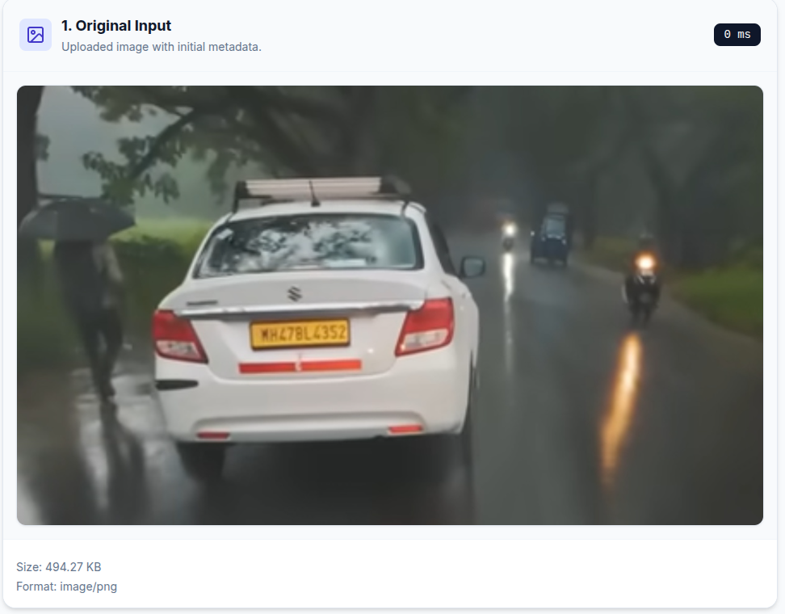
  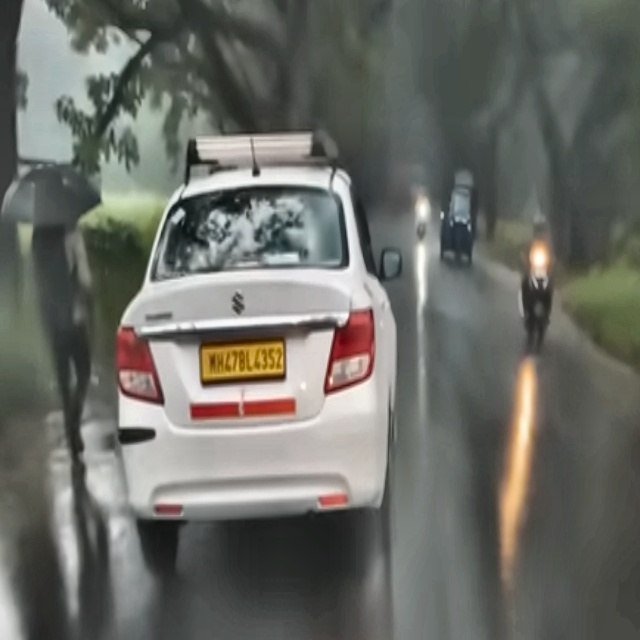
</p>

---

## 📸 Demo & Features Deep-Dive

### 🏍️ Helmet Non-Compliance
**How it works:** Analyzes motorcycle riders to verify helmet usage. Identifies motorcycles, isolates riders, and uses a specialized model to detect unhelmeted heads.
| Input Image | Detection Output |
| :---: | :---: |
| 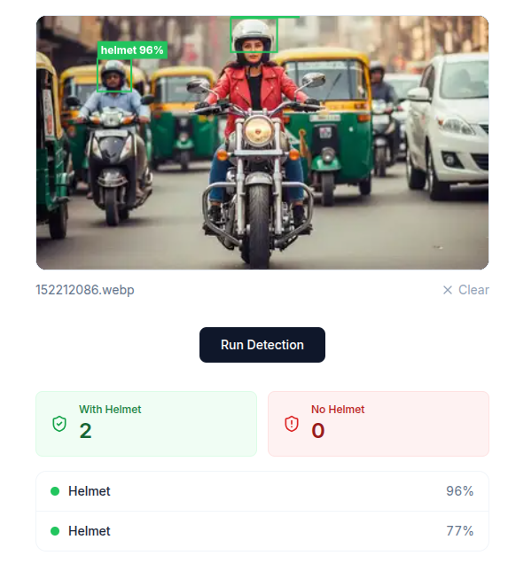 | 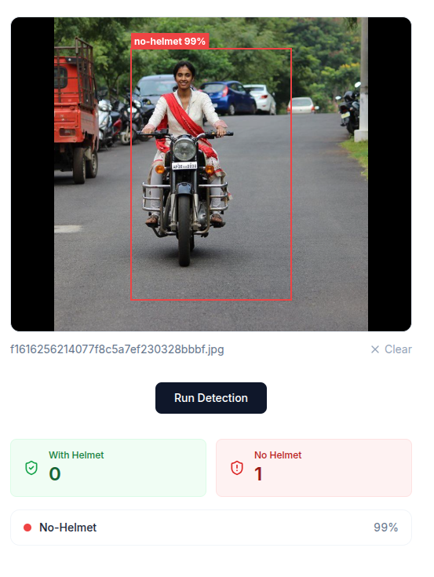 |

### 👨‍👩‍👦 Triple Riding
**How it works:** Enforces capacity limits on two-wheelers by counting the number of riders overlapping with the motorcycle's bounding box. Exceeding two passengers flags a violation.
| Input Image | Detection Output |
| :---: | :---: |
| 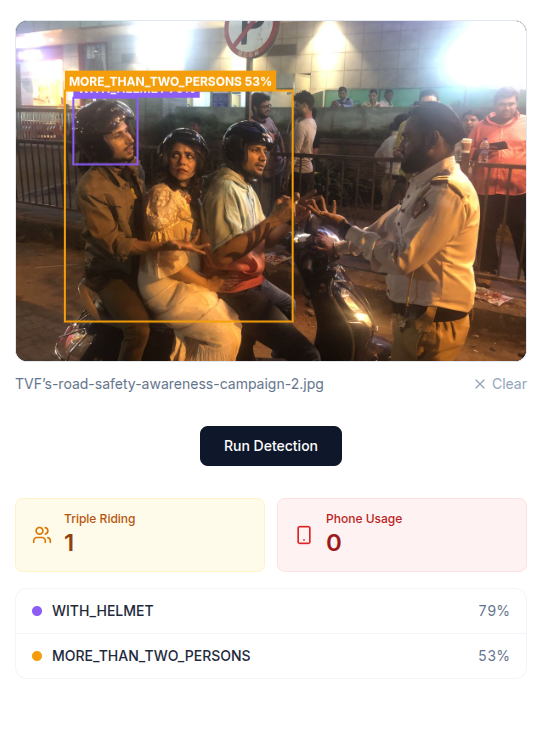 | 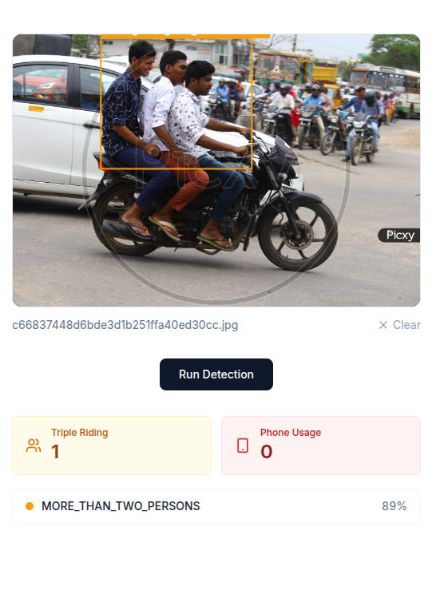 |

### 🚗 Seatbelt & Mobile Phone Detection
**How it works:** Scans the windshield area of detected cars to monitor driver compliance. Identifies if the driver is fastened with a seatbelt and flags mobile phone usage while driving.
| Seatbelt Detection | Phone Usage Detection |
| :---: | :---: |
| 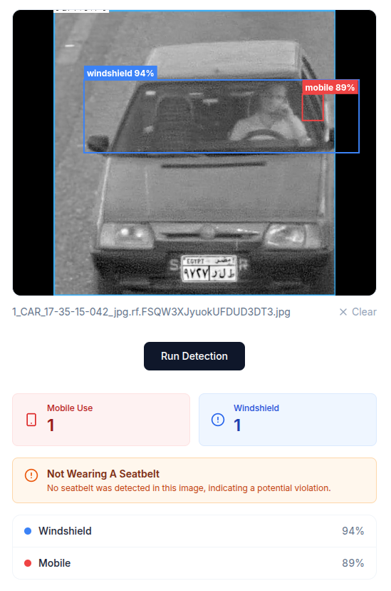 | 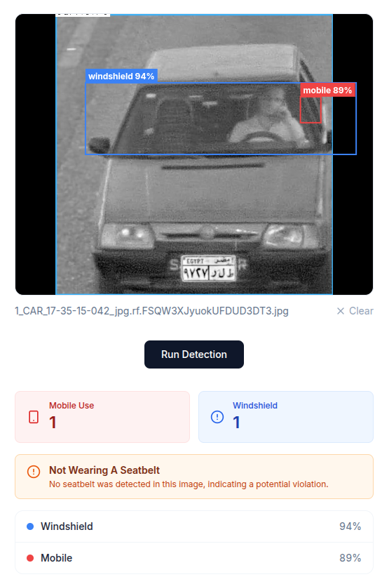 |

### 📸 License Plate OCR & Cropping
**How it works:** Once a violation is confirmed, the system extracts the license plate crop, applying preprocessing (grayscale, adaptive thresholding) before running an OCR engine (PaddleOCR/EasyOCR) to accurately extract alphanumeric text. A minimal crop is saved for evidence.
| Input Crop | OCR Extraction Output |
| :---: | :---: |
|  | 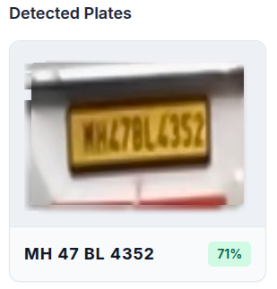 |

### 🛑 Stop-line Crossing & No-Parking Zones
- **Stop-line Crossing:** Automatically captures frames and generates evidence when vehicles cross designated stop-lines at signals.
- **No-Parking Detection:** Identifies stationary vehicles in restricted zones, tracks their parking duration, and logs illegal parking evidence automatically.
<p align="center">
  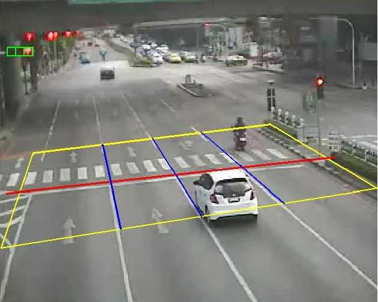
  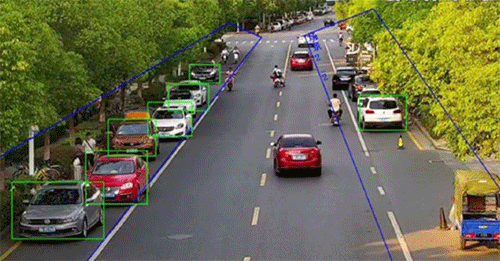
</p>

### 🔍 Vehicle Identification Without Number Plates
**How it works:** Identifying a vehicle without a visible number plate is a significant challenge. Our solution leverages visual embeddings and Facebook's similarity search algorithm (FAISS) to instantly find similar vehicles across millions of images, reducing manual investigation efforts.

---

## 📊 Analytics & Reporting Dashboard
The application features a comprehensive dashboard for traffic authorities:
- Violation frequency statistics.
- Heatmap-based traffic risk assessment and trends over time.
- Searchable violation records categorized by violation type.

<p align="center">
  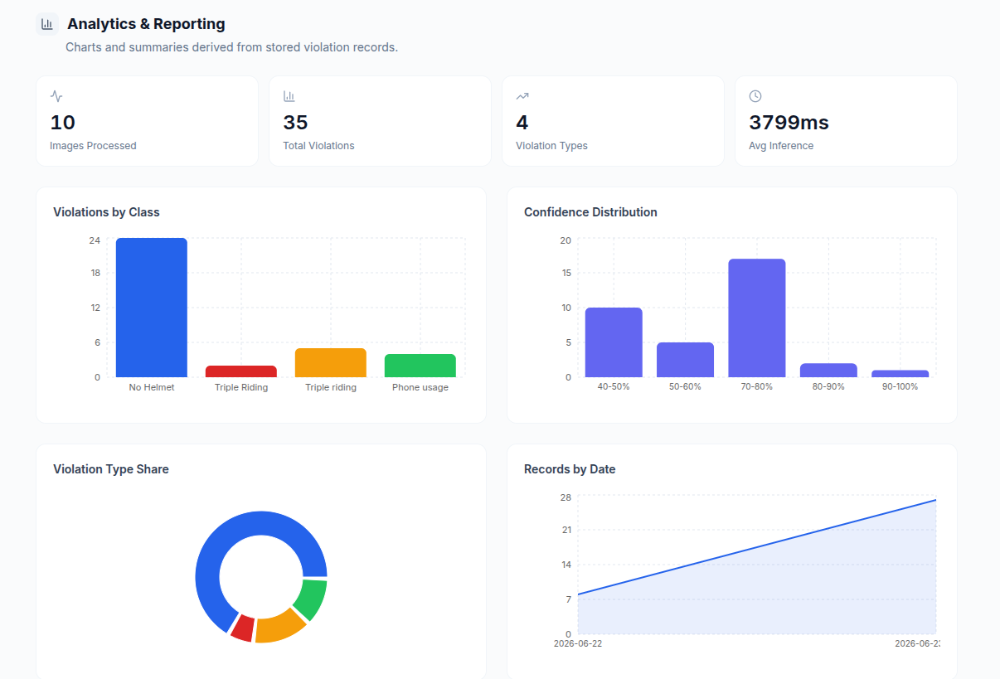
</p>

---

## 📈 Evaluation & Future Scope
The models are evaluated on metrics like **Accuracy, Precision, Recall, F1-Score, and mAP**.

**Future Developments:**
- Cloud-based tamper-proof evidence management.
- Real-time city-wide deployment on edge devices.
- Automated challan (ticket) generation.
- Fine-tuning YOLO models on larger, localized, real-world challan image datasets.

---

## 🚀 How to get started

### Prerequisites
- **Python 3.10+**
- **Node.js 18+** & **npm**
- **FFmpeg** (Required for video frame extraction)

### 1. Clone the repository
```bash
git clone https://github.com/akashch1512/Traffic-Violations-Using-Computer-Vision.git
cd Traffic-Violations-Using-Computer-Vision
```

### 2. Backend Setup
```bash
cd backend
python -m venv .venv
source .venv/bin/activate  # On Windows: .venv\Scripts\activate
pip install -r requirements.txt
uvicorn app.main:app --reload --host 0.0.0.0 --port 8000
```
> **Note:** API health check available at `http://localhost:8000/`. Interactive docs at `http://localhost:8000/docs`.

### 3. Frontend Setup
```bash
cd frontend
npm install
npm run dev -- --port 5173
```
> Access the web application at **[http://localhost:5173/](http://localhost:5173/)**.

### 💡 Usage Example
1. Open the frontend URL in your browser.
2. Upload a sample `.mp4` traffic clip.
3. Click **Analyze video** to extract frames, run YOLO/OCR, and generate violation evidence.

---

## 🤝 Who maintains and contributes
- **Maintainer:** [Abhay Kale](https://github.com/AbhayKale332) & [Akash Chaudhari](https://github.com/akashch1512)
- **Contributing:** We love pull requests! Please open an issue to discuss proposed changes before submitting a PR.

## ❓ Where to get help
- **Issues:** Check the [GitHub Issues](https://github.com/akashch1512/Traffic-Violations-Using-Computer-Vision/issues) tab.
- **Documentation:** Visit the Swagger UI at `http://localhost:8000/docs` while the server is running.

<div align="center">
  <p><i>Built with ❤️ for safer roads.</i></p>
</div>
